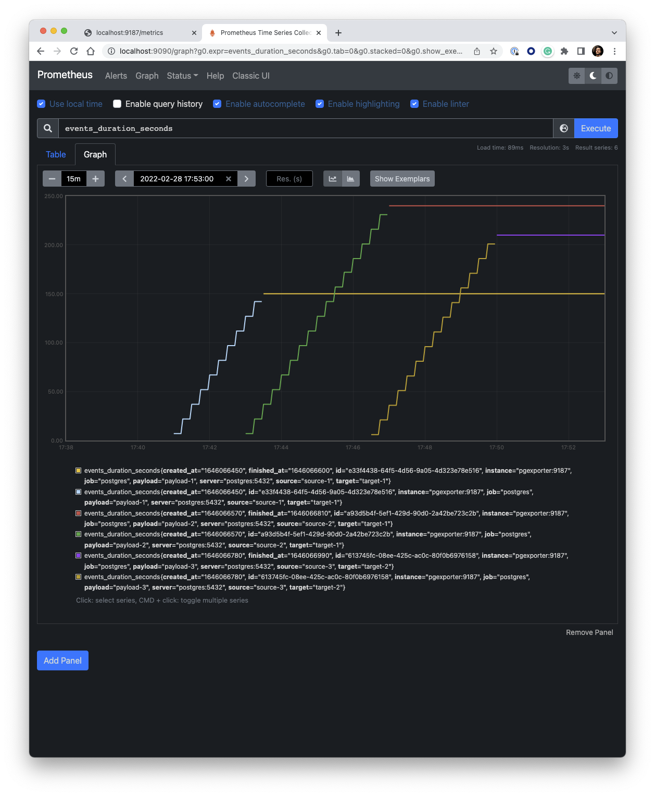
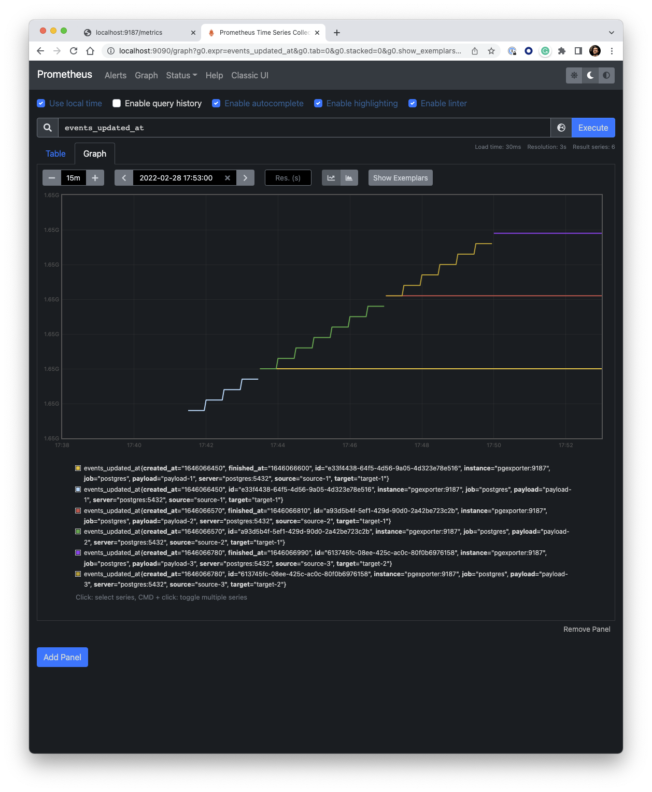
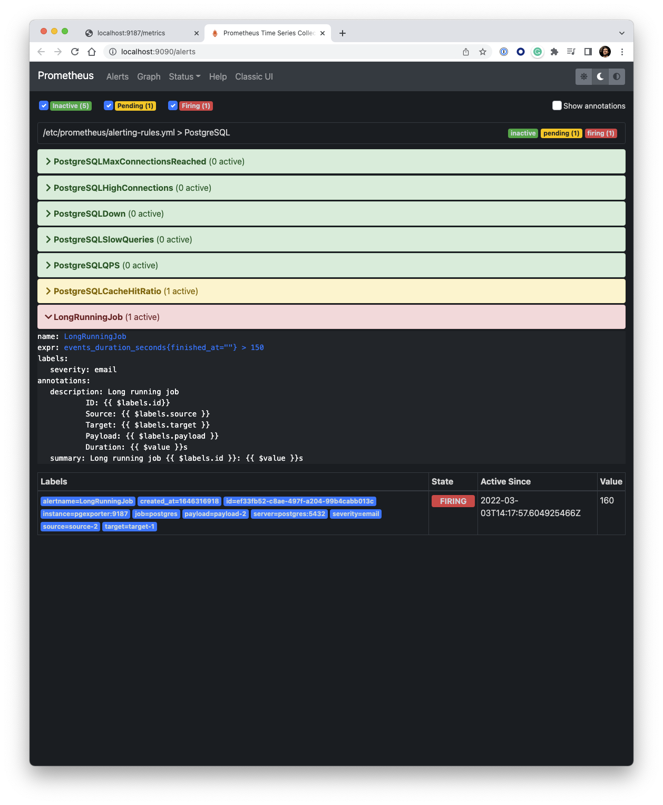
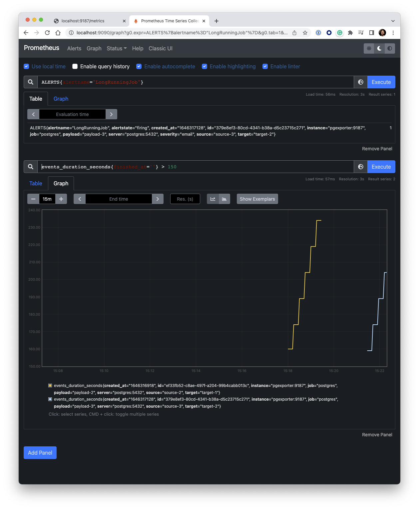

# Prometheus exporter for PostgreSQL Playground

> A `docker compose` based playground to get SQL queries as metrics into Prometheus

## Run

```shell
# start containers
docker compose up -d

# in case we need to rebuilt the images use
docker compose up -d --build

# running services
docker compose ps

# restart a service
docker compose restart pgexporter

# stop a service
docker compose stop grafana

# stop containers and remove volumes
docker compose down --volumes

# stop containers and remove everything
docker compose down --rmi all
```

## Test

```shell
# connect to database to run queries manually
docker exec -it postgres psql -U postgres -d test

# run queries in database
docker exec -it postgres psql -U postgres -d test -f /tmp/postgres/events.sql

# run queries in sequence (which takes 9 minutes)
docker exec -it postgres psql -U postgres -d test -f /tmp/postgres/events-in-sequence.sql
```

## Prometheus

- Check the exported metrics: <http://localhost:9187/metrics>
- Have a look at the rate at which the duration changes over time: <http://localhost:9090/graph?g0.expr=rate(events_duration_seconds%5B15m%5D)&g0.tab=0&g0.stacked=0&g0.show_exemplars=0&g0.range_input=15m>

> *Metric: `events_duration_seconds`*



> *Metric: `events_updated_at`*



> *Alerts: State*



> *Alerts: Timeseries*



## Pushgateway

### Push samples

```shell
# single sample
echo "some_metric 3.14159265359" \
  | curl --data-binary @- http://localhost:9091/metrics/job/pushgateway

# more complex sample for group {job="pushgateway",instance="pustgateway:9091"}
cat <<EOF | curl --data-binary @- http://localhost:9091/metrics/job/pushgateway/instance/pustgateway:9091
# TYPE some_metric counter
some_metric{label="val1"} 42
# TYPE another_metric gauge
# HELP another_metric Just an example.
another_metric 2398.283
EOF
```

### Delete metrics

```shell
# delete all metrics in group {job="pushgateway",instance="pustgateway:9091"}
curl -X DELETE http://localhost:9091/metrics/job/pushgateway/instance/pustgateway:9091

# delete all metrics in group {job="pushgateway"}
curl -X DELETE http://localhost:9091/metrics/job/pushgateway

# wipe all metrics
curl -X PUT http://localhost:9091/api/v1/admin/wipe
```
